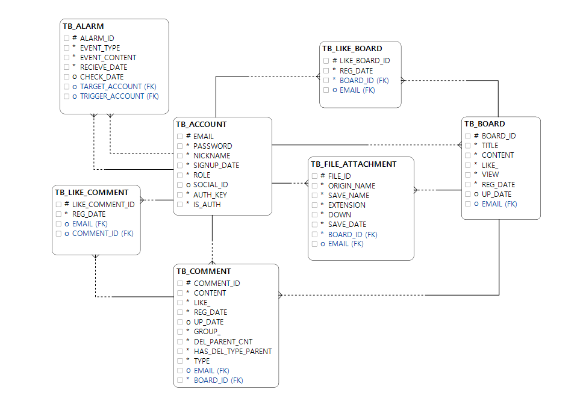

## 서비스
- https://myboard.joon.link
- 테스트 아이디
    - 아이디 : test01~05, 비밀번호 : 1234

## local 실행방법
1.본 레포지토리를 클론받는다.(git clone)

2.클론 받은 프로젝트 폴더에 properties 파일들을 생성

 
 properties 상세내용

 /resources/properties/private 경로에 아래의 properties 파일을 생성해야함
 
 - /resources/properties/private/database-config.properties
~~~
# MySQL Configuration
#### MySQL Configuration ###
spring.datasource.driver-class-name=com.mysql.cj.jdbc.Driver
spring.datasource.url=jdbc:mysql://localhost:3306/DB명?useSSL=false&characterEncoding=UTF-8&serverTimezone=Asia/Seoul
spring.datasource.username=유저네임
spring.datasource.password=비밀번호

###hikari 관련 옵션 ###
spring.datasource.hikari.maximum-pool-size=30
spring.datasource.hikari.minimum-idle=10
spring.datasource.hikari.connection-test-query=select now()

spring.jpa.generate-ddl=false
spring.jpa.show-sql=true
spring.jpa.properties.hibernate.format_sql=true
spring.jpa.database=mysql

##jpa mapping name strategy
spring.jpa.hibernate.naming.implicit-strategy=org.hibernate.boot.model.naming.ImplicitNamingStrategyLegacyJpaImpl
spring.jpa.hibernate.naming.physical-strategy=org.hibernate.boot.model.naming.PhysicalNamingStrategyStandardImpl
~~~ 
- /resources/properties/private/jwt-config.properties
~~~
# jwt decode & encode 문자열
jwt.secret=JWT
jwt.token.name=jwt-token
jwt.cookie.name=jwt-token
~~~
- /resources/properties/private/mail-config.properties
~~~
spring.mail.host=smtp.gmail.com
spring.mail.port=587
spring.mail.username= 메일
spring.mail.password= 비밀번호
spring.mail.properties.mail.smtp.starttls.enable=true
spring.mail.properties.mail.smtp.auth=true

mail.from=[별명]<이메일>
mail.auth.limit =3600000

mail.auth.url =localhost
~~~
- /resources/properties/private/oauth-config.properties
~~~
##Google
spring.security.oauth2.client.registration.google.client-id = 아이디
spring.security.oauth2.client.registration.google.client-secret = 시크릿
spring.security.oauth2.client.registration.google.scope = profile,email 

#Naver
spring.security.oauth2.client.registration.naver.client-id = 아이디
spring.security.oauth2.client.registration.naver.client-secret = 시크릿
spring.security.oauth2.client.registration.naver.redirect-uri={baseUrl}/{action}/oauth2/code/{registrationId}
spring.security.oauth2.client.registration.naver.authorization-grant-type=authorization_code
spring.security.oauth2.client.registration.naver.scope=name,email,profile_image
spring.security.oauth2.client.registration.naver.client-name=Naver

spring.security.oauth2.client.provider.naver.authorization-uri=https://nid.naver.com/oauth2.0/authorize
spring.security.oauth2.client.provider.naver.token-uri=https://nid.naver.com/oauth2.0/token
spring.security.oauth2.client.provider.naver.user-info-uri=https://openapi.naver.com/v1/nid/me
spring.security.oauth2.client.provider.naver.user-name-attribute=response

##Kakao
spring.security.oauth2.client.registration.kakao.client-id =아이디
#spring.security.oauth2.client.registration.kakao.client-secret = 필수가 아님
spring.security.oauth2.client.registration.kakao.redirect-uri={baseUrl}/{action}/oauth2/code/{registrationId}
spring.security.oauth2.client.registration.kakao.authorization-grant-type=authorization_code
spring.security.oauth2.client.registration.kakao.scope=account_email,profile
spring.security.oauth2.client.registration.kakao.client-name=Kakao

spring.security.oauth2.client.provider.kakao.authorization-uri=https://kauth.kakao.com/oauth/authorize
spring.security.oauth2.client.provider.kakao.token-uri=https://kauth.kakao.com/oauth/token
spring.security.oauth2.client.provider.kakao.user-info-uri=https://kapi.kakao.com/v2/user/me
spring.security.oauth2.client.provider.kakao.user-name-attribute=id
~~~

3.본문의 하단에 있는 "DataBase" 항목의 DDL을 참고하여 데이터베이스를 세팅

## 소개
### 게시판
#### 기능
- 게시물 CRUD + (첨부파일CRUD , 페이징)
- 댓글 CRUD + (대댓글, 삭제된 댓글 표시)
- 좋아요
- 알람(실시간)
- 검색
- 회원
  - 로그인, 로그아웃, 소셜로그인(Google, Naver, Kakao)
  - 회원가입 + 메일인증
- 메세지 국제화(한/영)

#### 적용기술
- SPA
- thymeleaf, vue.js + (jquery, summernote)
- spring boot
- spring security(JWT, Oauth2.0)
- spring data jpa, Querydsl
- MySQL
- cache(ehcache)
- WebSocket
- jmeter
### CI/CD
- aws codedeploy, s3
- travis

### Git Branch
- master/origin
- dev

## DataBase

ERD

 

 
DDL

 
 ~~~
create table TB_ACCOUNT(
    EMAIL varchar(100),
    PASSWORD varchar(100) not null ,
    NICKNAME varchar(30) unique ,
    SIGNUP_DATE datetime default now(),
    ROLE varchar(30) default 'MEMBER',
    IS_SOCIAL boolean default false,
    AUTH_KEY varchar(40) not null,
    IS_AUTH boolean default false,
    primary key(EMAIL)
);
~~~

~~~
create table TB_BOARD(
     BOARD_ID int auto_increment,
     TITLE varchar(110) not null ,
     CONTENT varchar(5000) not null ,
     LIKE_ int default 0,
     VIEW int default 0,
     REG_DATE datetime default now(),
     UP_DATE datetime,
     EMAIL varchar(100) ,
     primary key (BOARD_ID),
     foreign key (EMAIL) REFERENCES TB_ACCOUNT(EMAIL) on delete set null
);
~~~
~~~
create table TB_COMMENT(
    COMMENT_ID int auto_increment,
    BOARD_ID int not null ,
    CONTENT varchar(350) not null ,
    LIKE_ int default 0,
    REG_DATE datetime default now(),
    UP_DATE datetime,
    EMAIL varchar(100),
    GROUP_ int not null, ##COMMENT_ID 값이 들어감
    DEL_PARENT_CNT int default 0,
    HAS_DEL_TYPE_PARENT boolean,
    TYPE varchar(30) not null, ##PARENT_ID가 NULL 인데 TYPE이 CHILD면 알수없음 댓글 만들면 됨
    primary key (COMMENT_ID),
    foreign key (BOARD_ID) REFERENCES  TB_BOARD(BOARD_ID) on delete cascade ,
    foreign key (EMAIL) REFERENCES TB_ACCOUNT(EMAIL) on delete set null
);
~~~
~~~
create table TB_LIKE_BOARD(
    LIKE_BOARD_ID varchar(40),
    BOARD_ID int not null ,
    EMAIL varchar(100) ,
    REG_DATE datetime default now(),
    primary key (LIKE_BOARD_ID),
    foreign key (BOARD_ID) REFERENCES TB_BOARD(BOARD_ID) on delete cascade ,
    foreign key (EMAIL) REFERENCES TB_ACCOUNT(EMAIL) on delete set null
);
~~~
~~~
create table TB_LIKE_COMMENT(
    LIKE_COMMENT_ID varchar(40),
    COMMENT_ID int not null ,
    EMAIL varchar(100) ,
    REG_DATE datetime default now(),
    primary key (LIKE_COMMENT_ID),
    foreign key (COMMENT_ID) REFERENCES TB_COMMENT(COMMENT_ID) on delete cascade ,
    foreign key (EMAIL) REFERENCES TB_ACCOUNT(EMAIL) on delete set null
);
~~~
~~~
create table TB_FILE_ATTACHMENT(
    FILE_ID varchar(40),
    BOARD_ID int not null,
    ORIGIN_NAME varchar(70) not null ,
    SAVE_NAME varchar(70) unique ,
    EXTENSION varchar(20) not null ,
    DOWN int default 0,
    SAVE_DATE datetime default now(),
    EMAIL varchar(100) not null,
    primary key(FILE_ID),
    foreign key (BOARD_ID) REFERENCES TB_BOARD(BOARD_ID) on delete cascade,
    foreign key (EMAIL) REFERENCES TB_ACCOUNT(EMAIL) on delete cascade
);
~~~
~~~
create table TB_ALARM(
    ALARM_ID varchar(40),
    TARGET_ACCOUNT varchar(100) not null ,
    TRIGGER_ACCOUNT varchar(100) ,
    EVENT_TYPE varchar(100) not null ,
    EVENT_CONTENT_ID varchar(100) not null ,
    RECIEVE_DATE datetime default now(),
    CHECK_DATE datetime,
    primary key (ALARM_ID),
    foreign key (TARGET_ACCOUNT) REFERENCES TB_ACCOUNT(EMAIL) on delete cascade,
    foreign key (TRIGGER_ACCOUNT) REFERENCES TB_ACCOUNT(EMAIL) on delete set null
);
~~~
 

 
TB_ACCOUNT

|항목            | 설명                |key type    |data type              | unique   | nullable  |비고               |
 |----------------|--------------------|------------|-----------------------|----------|----------|-------------------|
 |EMAIL           |회원의 이메일        |primary     |varchar(100)             | unique   | not null |   이메일 패턴이여야 함, 최소 5자, 최대 40자|   
 |PASSWORD     	 |회원의 비밀번호		   |            | varchar(100)            |         | not null |숫자,영문,특문 8자이상 16이하 -> 암호화|
 |NICKNAME     	 |회원의 별명		   |           | varchar(30)            | unique   |          |최소4자 이상, 10자이하      |
 |SIGNUP_DATE  	 |회원 가입일		   |           | DATETIME default now() |          | not null |                      |                       |
 |ROLE       	 |회원의 권한		   |           | varchar(30) default 'MEMBER'|          | not null |MEMBER, ADMIN, SYSTEM 중 하나  |
 |IS_SOCIAL    	 |소셜 아이디 여부   |           | boolean default false    |          | not null       |             |
 |AUTH_KEY       |이메일 인증을 위한 키 |           | varchar(40)           |            | not null | 무작위 문자열   |
 |IS_AUTH        |이메일 인증을 한 계정인지 명시|    | boolean default false  |             | not null|  이메일 인증을 마치면 true  |

 
TB_BOARD

 
  |항목            | 설명                |key type                            |data type              | unique   | nullable  |비고                 |
 |---------------|---------------------|-----------------------------------|-----------------------|----------|-----------|---------------------|
 |BOARD_ID            |게시글 식별 번호      | primary(auto inc)                        | int                     |   unique | not null  |   |
 |TITLE          |게시글의 제목			|                                 |varchar(110)            |           | not null  | 공백금지,50자 이하   |
 |CONTENT     	|게시글의 내용			|                                 |varchar(5000)            |           | not null  |                   |
 |LIKE_     	|게시글의 좋아요			|                                 | int default 0          |          | not null  |                      |
 |VIEW       	|게시글의 조회수			 |                               | int default 0           |          | not null |                       |
 |REG_DATE     	|게시글 생성 날짜		    |                                | datetime default now()  |            |not null |                      |
 |UP_DATE     	|게시글 수정 날짜		    |                                | datetime                |           | null   |                        |
 |EMAIL         |게시글의 작성자         |	foreign(TB_ACCOUNT) on delete set null   |varchar(100)              |            |        |   이메일 패턴이여야 함|

 

 
TB_COMMENT

 
 |항목            | 설명                |key type                            |data type              | unique   | nullable  |비고                 |
 |---------------|---------------------|-----------------------------------|-----------------------|----------|-----------|---------------------|
 |COMMENT_ID            |댓글을 식별하는 ID|primary(auto inc)                | int         | unique     | not null  |                  |
 |BOARD_ID            |댓글이 작성된 게시물 ID |foreign(TB_BOARD) on delete casecade| int              |             | not null  |     |
 |CONTENT        |댓글의 내용            |                                  | varchar(350)       |           |   not null  |공백금지,150자이하      |
 |LIKE_     	|댓글의 좋아요		    |                                  | int default 0      |           |   not null  |                      |
 |REG_DATE       |댓글의 생성 날짜        |                                 | datetime default now()|        |  not null |                         |
 |UP_DATE       |댓글의 수정 날짜        |                                  |datetime|                      | null |                              |
 |EMAIL         |댓글의 작성자           | foreign(TB_ACCOUNT) on delete set null| varchar(100)     |         |   null |이메일 패턴이여야 함            |
 |GROUP_        |댓글의 그룹 번호(COMMNET_ID)|                              |int                  |           |not null      |대댓글 관계를 구분하기 위함|
 |DEL_PARENT_CNT|삭제된 부모댓글의 개수    |                                | int default 0        |           |not null||
 |HAS_DEL_TYPE_PARENT |삭제된 부모댓글들 중 타입 PARENT가 있는지 |           | boolean             |            |          |                       |
 |TYPE          |댓글이 부모인지, 자식인지 구분|                               |varchar(30)        |           |not null|              |
 
 

 
 
 

 
TB_LIKE_BOARD

 
 |항목            | 설명                          |key type                             |data type                      | unique   | nullable  |비고                 |
 |---------------|-------------------------------|-------------------------------------|-------------------------------|----------|-----------|---------------------|
 |LIKE_BOARD_ID             |좋아요 이력을 식별하는 UUID      | primary                             | varchar(40)                   | unique  | not null  |             |
 |BOARD_ID            | "좋아요"가 눌린 게시물 ID       | foreign(TB_BOARD)  on delete cascade| int                           |          | not null  |                    |
 |EMAIL          | "좋아요"를 누른 유저             | foreign(TB_ACCOUNT) on delete set null |varchar(100)                 |          |    null | 이메일 패턴이여야 함  |
 |REG_DATE      	 | "좋아요"를 누른 날짜             |                                     | datetime default now()     |          |not null |                      |
 
 

 
 

 
TB_LIKE_COMMENT

 
  |항목            | 설명                          |key type                             |data type                      | unique   | nullable  |비고                 |
  |---------------|-------------------------------|-------------------------------------|-------------------------------|----------|-----------|---------------------|
  |LIKE_COMMENT_ID             |좋아요 이력을 식별하는 ID      | primary                             | int                    | unique  | not null  |                     |
  |COMMENT_ID            | "좋아요"가 눌린 댓글 ID         | foreign(TB_COMMENT)  on delete cascade| varchar(40)                   |          | not null  |                    |
  |EMAIL          | "좋아요"를 누른 유저             | foreign(TB_ACCOUNT) on delete set null |varchar(100)|                |  null | 이메일 패턴이여야 함  |
  |REG_DATE      	 | "좋아요"를 누른 날짜          |                                  | datetime default now()        |          |not null |                      |
 
 

 
  
 

 
TB_FILE_ATTACHMENT

 
 |항목            | 설명                          |key type                             |data type                      | unique   | nullable  |비고                 |
 |---------------|-------------------------------|-------------------------------------|-------------------------------|----------|-----------|---------------------|
 |FILE_ID            | 파일을 식별하는 UUID            |primary                              | varchar(40)                  | unique    | not null |                      |
 |BOARD_ID            | 파일이 저장된 게시물 ID         |foreign(TB_BOARD) on delete cascade   | int                         |           |  not null   |                   |
 |ORIGIN_NAME    | 파일의 원래 이름                |                                     |  varchar(70)                 |             |not null      |  공백금지, 확장자 필요|
 |SAVE_NAME     | 파일이 서버에 저장된 이름(FID+확장자)|                                  |  varchar(70)                  |   unique    |   not null   공백금지, 확장자 필요  |
 |EXTENSION      | 파일의 확장자                   |                                   | varchar(20)                   |              |not null   |     10글자 이상불가     |
 |DOWN           | 파일 다운로드 횟수              |                                    |   int default 0             |               | not null |                    |
 |SAVE_DATE      | 파일이 저장된 날짜              |                                    |  datetime default now()     |                | not null|                    |
 |EMAIL          | 파일을 저장한 사용자의 이메일    | foreign(TB_ACCOUNT) on delete cascade |  varchar(100)              |              |  not null |                   |
 
 

 

 
TB_ALARM

 
 |항목            | 설명                                           |key type                             |data type                      | unique   | nullable  |비고                 |
 |---------------|------------------------------------------------|-------------------------------------|-------------------------------|----------|-----------|---------------------|
 |ALARM_ID            | 알람을 식별하는 UUID                             |primary                              | varchar(40)                   | unique   | not null  |                    |
 |TARGET_ACCOUNT   | 알람을 받은 대상(시스템, 관리자, 다른 회원 등)      |foreign(TB_ACCOUNT) on delete cascade | varchar(100)                  |          | not null  |  대상 ID      |
 |TRIGGER_ACCOUNT   | 알람을 발생시킨 대상(시스템, 관리자, 다른 회원 등) |foreign(TB_ACCOUNT) on delete cascade |  varchar(100)                 |         |  null  |  대상 ID         |
 |EVENT_TYPE      | 어떤 알람 이벤트인지(좋아요 알림, 대댓글알림 , 시스템 공지 등)|                           |  varchar(100)                |          | not null   |  40자 이상 불가 |
 |EVENT_CONTENT_ID   | 알람이벤트가 발생한 컨텐츠의 ID                  |                                   |  varchar(100)                  |         |not null    |                |
 |RECIEVE_DATE      | 알람을 받은 날짜                                 |                                   | datetime default now()         |         |  not null  |                 |
 |CHECK_DATE      | 알람을 읽은 날짜                                 |                                    | datetime                       |          | null      |                 |

 

 ## Spring Security
 ### Filter
 |경로                    |예외경로            |Filter         | Provider                                  |success                             |fail                      |
 |------------------------|-------------------|-------------|--------------------------------------------|-------------------------------------|-----------------------|
 |/api/account/signIn     |                   |SignInFilter   | 로그인 성공 여부 판단                      | jwt토큰을 쿠키에 담아 반환           | Exception 발생        |
 |/api/account/signOut     |                   |SignOutFilter   | 없음                      | contextholder를 비우고 쿠키제거           |         |
 |/api/**                 |/api/account/signIn,signOut|JwtFilter      | 토큰 유효성 판단(토큰이 없는 경우는 success)| chain.doFilter()                    | Exception 발생        |
 
 
 
 ## 할 것
 - @FileSize , @FileExtension 대충 복붙한거 리팩토링필요함
     - extension 유효성 검사에서 . 으로 나누고 length 2아닐때 예외던지게 했는데 고쳐야함(ex: abc.def.hwp)
 - 프로퍼티즈 이용해서 확장자 제한 관리를 하는 것 필요
 - boardService의 파일다운로드에서 byte[4096]인거 설정파일에서 읽게 수정해야함
 - 패키지, 클래스 관계도 그려보자 순환참조라던가 양방향참조가 존재하는지...

### 메모    
- valid 
    - message 정의하던 부분     
    ~~~
          if (isExistEmail) {
              cxt.disableDefaultConstraintViolation();
              cxt.buildConstraintViolationWithTemplate(
                      MessageFormat.format("이미 존재하는 이메일 입니다. \n ({0})", email))
                      .addConstraintViolation();
          }
    ~~~ 

- enum 
    - @converter를 사용하는 방법 고려
        - https://lng1982.tistory.com/279   @Converter를 이용하는 방법 고려        
        
### 피드백
- 대댓글에서 삭제된 댓글 표시할려고 컬럼추가했잖아? 그냥 flag로 삭제처리하고서 뱃치로 나중에 정리해
    - flag + batch 조합이게더 싸게먹혀

